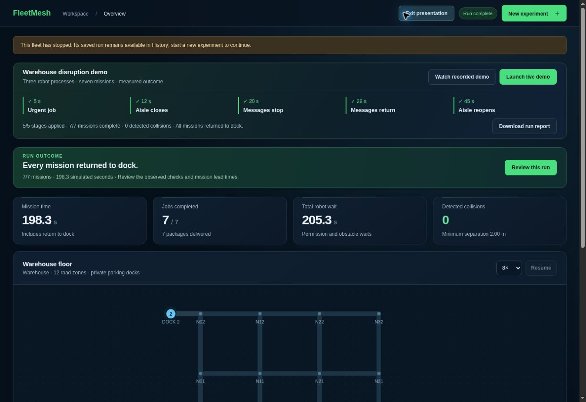
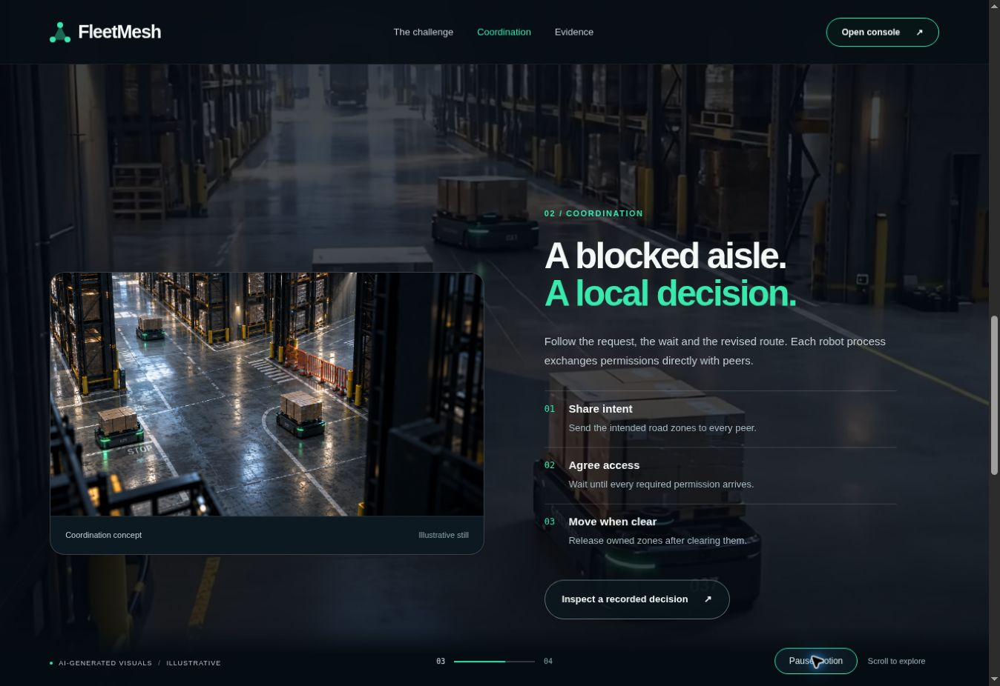

# Cloud release verification — 15 September 2026

## Deployment status

- Working Render service: https://fleetmesh-api.onrender.com (bundled cinematic page)
  and https://fleetmesh-api.onrender.com/app (console). This is also the Python API.
- Requested frontend host: Vercel. Production deployment was submitted as
  `dpl_9YNNDsmjtoZKE8Ko2L33AtibuoSR`. Its returned URLs require Vercel authentication.
  The connected account's project inspection also returns 403, so build status,
  canonical public production domain, and browser-to-API proxy flow remain unverified.
  Reconnect Vercel with access to team `mohitchaudhari018-4820s-projects`, then inspect
  the existing `fleetmesh` project. Do not create another project.
- Backend: Render `srv-dakm966k1f9s73dq9050`, Singapore, free, one instance.
- Database: existing Neon project `twilight-hat-02267104`, database `fleetmesh`,
  production branch `br-purple-pine-b3gbko9x`. Migration and application writes were
  first checked on isolated branch `br-dark-meadow-b3vir9fg`.
- Render uses its default TCP health check. `render.yaml` specifies `/api/health`;
  the connected tools cannot change the existing service's health-check path.
  Set that path in Render's existing service settings for HTTP health checks.

## Completed checks

51 Python tests pass, including real independent processes and HTTP requests,
visitor ownership/CSRF/origin checks, duplicate commands, capacity limits, persisted
restart receipts, database outage/recovery, process cleanup, loaded-cargo ownership,
occupied-aisle closure/cancellation, and communication loss/recovery.

34 console harness checks and 36 cinematic harness checks pass. The console
harness drives a real HTTP/UDP backend with DOM/canvas stubs. The cinematic suite
includes a regression for the browser scheduler's required Window receiver.
These harnesses do not prove responsive layout or physical safety.

Production Render/Neon checks completed:

- Real browser launches three robot agents, completes the disruption demonstration,
  refreshes, finds history, and opens saved replay. A run completed seven missions
  in 198.3 simulated seconds, with zero detected collisions and two route recoveries.
- Direct HTTP check confirms private visitor history, cross-visitor run rejection,
  duplicate start receipt, three distinct worker PIDs, matching saved metrics,
  and JSON/replay, CSV and HTML report retrieval.
- Neon independently confirms persisted completed runs and sampled frames.
- After deployment, the original visitor cookie still retrieved completed results,
  interrupted replay frames and duplicate-command receipts. A second explicit
  restart kept the test visitor active with polling: it observed its live session
  disappear and retrieved the saved interrupted replay. Robot processes did not resume.
  Confirmed Render restart deployment: `dep-dakmvqgu01pc73fn945g`.
- Application console had no application-origin errors in the verified console
  flow. Browser-extension errors are separate. The cinematic browser check found
  an illegal scheduler invocation. After deployment of the fix, real browser
  checks observed frame 0 advancing to frame 133, chapter 01 changing to 03,
  and the motion control changing to Resume motion / Motion paused. No application
  errors appeared in the fresh cinematic tab.

Automated requests from the development environment sometimes timed out opening
its outbound proxy tunnel. The smoke script uses bounded retries and stable command
IDs. A fast run finished before one delayed pause request; the restart preparation
now uses a slow, larger workload. Do not report those attempts as clean passes.

## Matched hosted performance check

Warehouse map, normal scenario, seed 200, three robots, six identical jobs,
32× requested playback speed. Completion includes return to dock. Timing below
is simulated mission makespan, not wall-clock request latency.

| Policy | Completion | Detected collisions | Saved replay frames |
|---|---:|---:|---:|
| Baseline, sequential zones | 186.8 s | 0 | 25 |
| FleetMesh fixed rule | 153.3 s | 0 | 19 |

Reduction: `(186.8 - 153.3) / 186.8 = 17.9%`. This single pair does not meet the
20% target or establish a general average. PostgreSQL confirms equal configuration
hashes after excluding policy and per-run epoch. Run IDs:
`2c0af62619064872b1b940d592b62100`, `e908431c8f6f4430ba1c885c3963bce5`.

The retained 160-run historical benchmark is a different dataset. Do not combine
its counts with this hosted pair or call it a new cloud benchmark.

## Resource observations and remaining checks

Render reported a 512 MiB memory limit. Observed one-minute memory samples peaked
at about 103 MiB during these checks. This is a sampled observation, not a worst-case
guarantee for two six-agent fleets. Fleet/session/request/retention caps are enforced.
Free-tier sleep, restarts and account-shared quotas remain presentation risks.

Mobile browser layout, real-device reduced motion, final projector behavior,
public Vercel proxy cookies, and sustained maximum-capacity load remain unverified.
The browser's download policy blocked a download-link test; HTTP exports passed.
Physical AMRs, independent hardware clocks, real Wi-Fi, noisy localization,
braking and safety certification remain future work.

## Reproduction

```sh
python -m unittest discover -s tests -v
node --experimental-vm-modules tests/cinematic_checks.mjs
npm run check
npm run build
python scripts/cloud-smoke.py https://fleetmesh-api.onrender.com --state-file /tmp/fm-check.json
# Restart the backend without rotating SESSION_SECRET, then:
python scripts/cloud-smoke.py https://fleetmesh-api.onrender.com --state-file /tmp/fm-check.json --verify-restart
```

The state file contains the testing visitor's cookie. Keep it private and delete it
after testing. `--prepare-restart` can prepare a fresh paused run from an existing
state file without repeating the benchmark. See [CLOUD.md](CLOUD.md) for architecture,
deployment configuration and the three-minute judge script.

## Current presentation

[Updated six-slide cloud pitch](FleetMesh_SIH26123_Cloud_Pitch.pptx) includes the actual
hosted console screenshot and corrected cloud/validation claims. The native historical
chart and its original workbook are preserved. Enter the registered team name and ID
before submission. Older pitch/PDF files remain historical material.




